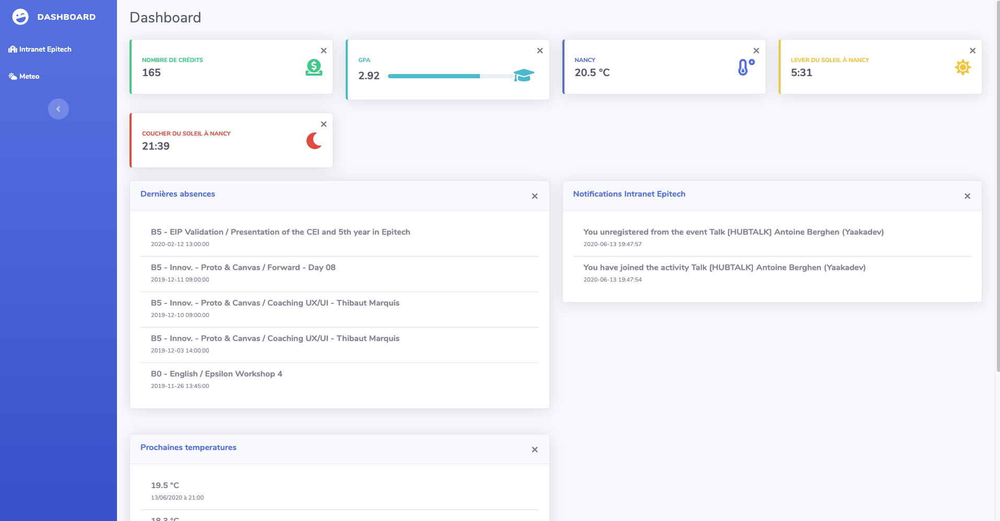
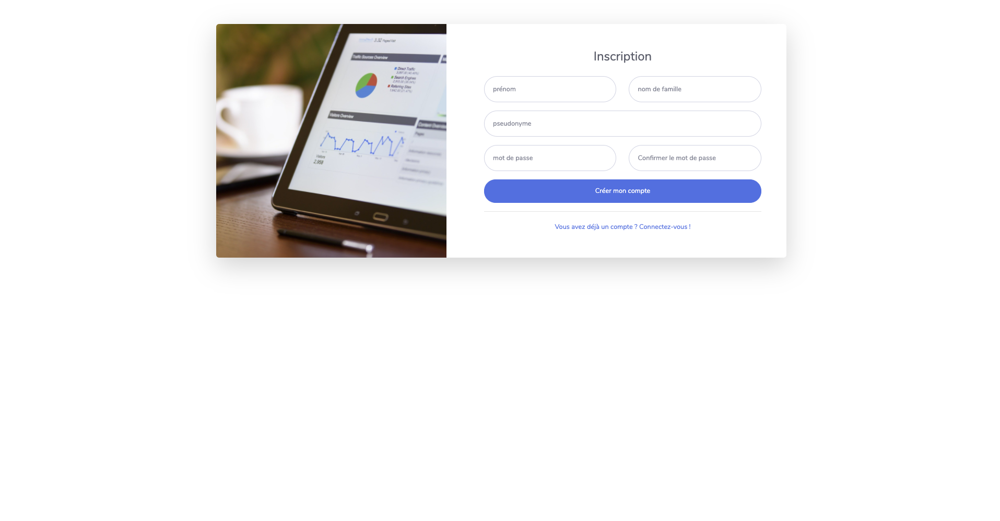

# Epitech

Le but du projet était de réaliser un tableau de bord où chaque utilisateur peut ajouter des widgets dessus pour le personnaliser. L’application propose deux grands groupes de widgets: les widgets relatifs à la météo et ceux relatifs à l’intranet Epitech. Pour utiliser les widgets de l'intranet Epitech, il est nécessaire de posséder un code d'autologin sous cette forme auth-XXXXXXXXXX. Pour les widgets de la météo, c'est une clé d'api du service suivant qu'il est nécessaire de posséder: https://www.weatherbit.io/api. Il est nécessaire de renseigner la clé api du service météo dans le fichier .env du répertoire "server" pour pouvoir utiliser ce service. Renseigner un autologin (auth-XXXXXXXXXX) epitech dans ce fichier, ne sert qu'à la bonne exécution des tests unitaires lorsque ceux-ci testeront les routes vers l'intranet Epitech.

## Widgets Disponibles

### Widgets Météo :
* Affichage de la température actuelle
* Affichage de la température pour les 5 prochaines heures
* Affichage de l’heure du lever du soleil
* Affichage de l’heure du coucher du soleil
 
### Widgets Intranet Epitech :
* Affichage du nombre de crédits d’un étudiant
* Affichage du GPA d’un étudiant
* Affichage des 5 dernières absences d’un étudiant
* Affichage des 5 dernières notifications de l’intranet pour un étudiant
 

## Lancement de l'application

Après avoir cloné le repo, l’exécution des commandes suivantes, à la racine, permettront de lancer l’application.

```
$ docker-compose build
$ docker-compose up
```

Après cette opération, l’application est accessible à l’adresse suivante :
localhost:8080/



